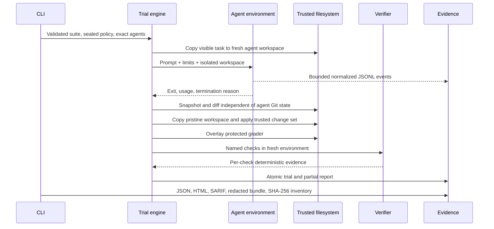

# Architecture

## Purpose

`forgetest` is an execution-backed regression and evidence harness for Rust
coding agents. It treats a model response as an untrusted proposal, not as a
scoreable text completion. The trusted system captures the proposal as a
filesystem patch and verifies it in a separate workspace.

The original function-level snippet evaluator remains available and its report
format remains readable. Repository trials use schema v2 and a distinct
lifecycle.

## Crate Boundaries

| Crate | Trusted responsibility |
|---|---|
| `forgetest-core` | Strict schemas, content identities, trial scheduler/state machine, patch capture, report v1/v2, statistics, comparison |
| `forgetest-agents` | External command profiles, Codex/Claude adapters, scripted agent, live event normalization, budgets, benchmark lock |
| `forgetest-runner` | Local snippet execution, Docker snippet runner, local/Docker repository graders, calibration |
| `forgetest-providers` | Legacy completion providers and trusted configuration loading |
| `forgetest-report` | Self-contained HTML, deterministic SARIF, redaction, artifact manifests |
| `forgetest-cli` | Precedence, preflight, workflow selection, evidence orchestration |

Core interfaces are language-neutral:

- `AgentExecutor`: execute one agent request and return a normalized outcome.
- `WorkspaceEnvironment`: choose trusted host or outer-container execution.
- `Grader`: execute named checks against a verification workspace.
- `EventSink`: persist normalized events without binding the core to a vendor.

Rust is the only fully supported v1 task language.

## Repository Suite

A suite has a versioned `suite.toml` and task directories. Each task records:

- Stable ID, category, Rust language, prompt, and visible workspace.
- Protected grader tree that is never materialized into the agent workspace.
- One legacy verifier command or named checks; publishable corpus tasks use
  fail-to-pass and pass-to-pass checks.
- Optional reference patch for calibration only.
- Timeout, tags, license, source URL/revision, and audit date.

Loading is strict: unknown fields, duplicate IDs, symlinks, path traversal,
missing files, unsupported languages, invalid verifier shapes, and incomplete
snapshot provenance fail before execution. Suite and task SHA-256 identities
include their trusted metadata and file content.

## Trial Data Flow

The engine creates a unique private directory per trial. It records every
scheduled outcome, including setup failures and timeouts. Partial reports are
atomically replaced after each completed trial so a run interruption still
leaves inspectable state.

Retries restore the pristine visible workspace before the next agent attempt.
Time, token, and cost budgets are cumulative across attempts.

## Agent Execution

Development mode invokes an installed CLI through `ProcessAgent`. It clears the
environment, creates an isolated home, passes only the profile allowlist, sends
the prompt on stdin, streams bounded output into typed events, and terminates
the process group on timeout or output overflow on Unix. Windows development
mode terminates the direct child; benchmark publication uses containers.

Benchmark mode wraps the same profile in an ephemeral Docker container. The
workspace is the only host bind mount. The container has a read-only root,
non-root UID, dropped capabilities, `no-new-privileges`, resource limits, and
an isolated tmpfs home. Agent networking is allowed because hosted APIs require
it. The Docker socket and host home are never mounted.

Unknown vendor JSON events retain their raw value in the private trace so an
adapter upgrade does not silently discard evidence. Public redaction removes
raw vendor payloads and free-form model messages.

## Verification

The agent never sees the protected grader. After the agent exits:

1. The engine captures changed files from trusted before/after snapshots.
2. It applies those changes to a new copy of the original workspace.
3. It overlays the hidden grader into that verification copy.
4. It executes each named check in a fresh verifier environment.

Published benchmark policy requires the Docker verifier. It has no network,
uses a read-only root, drops all capabilities, enables
`no-new-privileges`, runs non-root, uses tmpfs target output, applies
memory/CPU/PID/output/time limits, and receives only that trial's workspace.

No target or Cargo cache is shared across repository trials, preventing one
trial from poisoning another. The verifier image contains a locked, offline
Rust dependency cache.

## Identity and Locking

`benchmark.lock.toml` records:

- Suite and complete execution-policy SHA-256.
- Immutable verifier and agent image references.
- Agent executable path-derived SHA-256 and exact CLI version observed inside
  each image.
- Exact adapter, model, effort, and command-profile digest.

The policy digest covers concurrency, trial count, all budgets, retry count,
workspace and patch bounds, agent images, and container resources. The engine
recomputes it before scheduling work. Benchmark preflight rejects drift in the
requested model string, command profile, observed CLI/image/binary identity,
suite, or policy. Provider-side routing is only observable when vendor events
report the resolved model.

## Outcomes and Statistics

Repository status is categorical:

- `passed`
- `failed`
- `agent_error`
- `environment_error`
- `grader_error`
- `timeout`
- `cancelled`

The primary outcome is binary: all required checks pass. Weighted
compile/test/structure/clippy scoring exists only for legacy snippets and
secondary diagnostics.

Aggregates include observed and infrastructure-filtered resolution rates,
Wilson 95% intervals, pass@1, all-three-trials reliability (`pass^3`), timing,
reported cost, status counts, and deterministic task-paired bootstrap
comparisons.

## Evidence Schemas

Legacy `EvalReport` JSON remains readable. New snippet reports store the score
computed at run time and a manifest with SHA-256 content identities.

`RepositoryReport` schema v2 stores suite/task/policy identities, agent
identity, environment identity, patch, files, grader evidence, events, usage,
timing, artifacts, attempts, termination, and redaction state.

SARIF contains only deterministic compiler, Clippy, and grader findings. It
does not turn free-form model messages into code-scanning alerts.

Comparisons are gating-eligible only when suite, every task, and execution
policy identities match.
