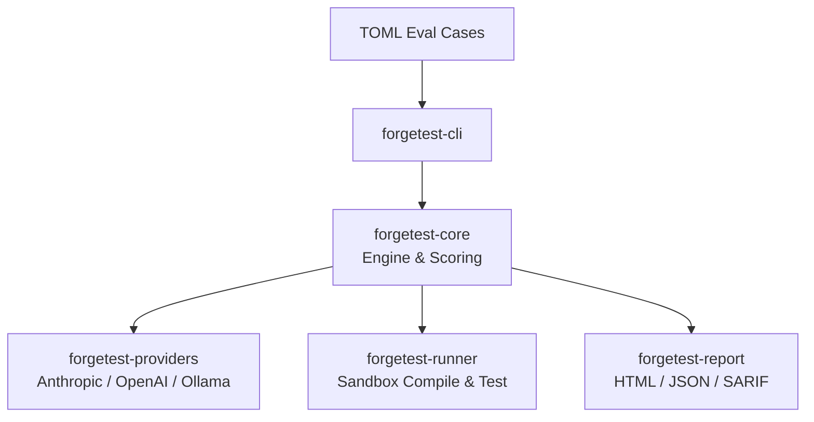

# forgetest

> LLM Code-Quality Eval Harness for Rust — "pytest for LLM outputs"

CI-ready, Rust-native, blazing-fast evaluation framework for benchmarking LLM code generation quality.

[](https://github.com/MysterionRise/forgetest/actions/workflows/ci.yml)
[](#license)

## Features

- **Multi-provider support** — Anthropic, OpenAI, and Ollama (local models)
- **Sandboxed execution** — Generated code compiles and runs in isolated temp projects
- **Pass@k scoring** — Standard unbiased Pass@k estimator from the Codex paper
- **Regression detection** — Compare reports across runs to catch quality drops
- **Multiple output formats** — JSON, HTML (self-contained), SARIF (GitHub Code Scanning)
- **Parallel evaluation** — Configurable concurrency with semaphore-based limiting
- **TOML eval cases** — Declarative eval definitions with test expectations
- **30 built-in eval cases** — Basics, algorithms, and async Rust tasks

## Quick Start

```bash
# Install from source
cargo install --path crates/forgetest-cli

# Initialize a project with sample config and eval set
forgetest init

# Edit forgetest.toml with your API keys, then validate:
forgetest validate --eval-set eval-sets/rust-basics.toml

# Run evaluations
forgetest run --eval-set eval-sets/rust-basics.toml --models anthropic/claude-sonnet-4-20250514
```

### Example Output

```
forgetest v0.1.0 — Running 15 eval cases x 1 models x 1 attempts

  Starting: claude-sonnet-4-20250514 :: fibonacci (attempt 1)
  Done: claude-sonnet-4-20250514 :: fibonacci [1] compile OK tests 3/3 (2450ms)
  Starting: claude-sonnet-4-20250514 :: is_palindrome (attempt 1)
  Done: claude-sonnet-4-20250514 :: is_palindrome [1] compile OK tests 4/4 (1820ms)
  ...

Complete: 15/15 succeeded, 0 failed (34.2s)

 Model            | Pass@1  | Compile % | Test Pass % | Cost    | Latency
 claude-sonnet-4  | 93.3%   | 100.0%    | 96.0%       | $0.0842 | 2280ms
```

## Architecture



```
forgetest/
├── crates/
│   ├── forgetest-core/        # Eval engine, traits, scoring
│   ├── forgetest-runner/      # Sandboxed compilation & test execution
│   ├── forgetest-providers/   # LLM provider integrations
│   ├── forgetest-report/      # HTML/JSON/SARIF report generation
│   └── forgetest-cli/         # CLI binary
├── eval-sets/                 # Built-in eval case collections
│   ├── rust-basics.toml       # 15 fundamental Rust tasks
│   ├── rust-algorithms.toml   # 10 advanced algorithm tasks
│   └── rust-async.toml        # 5 async Rust tasks
├── benches/                   # Criterion benchmarks
├── docs/                      # mdBook documentation
└── examples/
```

## Writing Eval Cases

Eval cases are defined in TOML. Each case includes a prompt, expected behavior, and a test file:

```toml
[eval_set]
id = "my-evals"
name = "My Eval Set"
default_language = "rust"

[[cases]]
id = "fibonacci"
name = "Fibonacci function"
prompt = """
Write a Rust function `fn fibonacci(n: u64) -> u64` that returns
the nth Fibonacci number using an iterative approach.
"""
tags = ["algorithms"]

[cases.expectations]
should_compile = true
should_pass_tests = true
test_file = """
#[cfg(test)]
mod tests {
    use super::*;
    #[test]
    fn test_fib() {
        assert_eq!(fibonacci(0), 0);
        assert_eq!(fibonacci(10), 55);
    }
}
"""
expected_functions = ["fibonacci"]
```

See the [full documentation](docs/src/writing-eval-cases.md) for all options.

## CLI Commands

| Command | Description |
|---------|-------------|
| `forgetest run` | Run evaluations against LLM models |
| `forgetest compare` | Compare two reports for regressions |
| `forgetest validate` | Validate eval set TOML files |
| `forgetest list-models` | List available models from providers |
| `forgetest init` | Create starter config and example eval set |

### Common Usage

```bash
# Run with multiple models
forgetest run --eval-set eval-sets/ \
  --models anthropic/claude-sonnet-4-20250514,openai/gpt-4.1 \
  --pass-k 1,5 --parallelism 8

# Compare runs for regressions
forgetest compare --baseline results/baseline.json --current results/latest.json \
  --fail-on-regression

# Output in multiple formats
forgetest run --eval-set eval-sets/rust-basics.toml --format all --output ./results
```

## Scoring

forgetest uses a weighted scoring system:

| Component | Weight | Description |
|-----------|--------|-------------|
| Compilation | 40% | Does the generated code compile? |
| Tests | 50% | What fraction of tests pass? |
| Clippy | 10% | Are there any clippy warnings? |

**Pass@k** is computed using the unbiased estimator from the [Codex paper](https://arxiv.org/abs/2107.03374): given `n` samples with `c` correct, Pass@k = 1 - C(n-c, k) / C(n, k). This avoids the bias of simply averaging k attempts.

## Comparison with Alternatives

| Feature | forgetest | EleutherAI harness | Custom scripts |
|---------|-----------|-------------------|----------------|
| Language | Rust-native | Python | Varies |
| Sandboxed execution | Yes (isolated Cargo projects) | No | Manual |
| Pass@k scoring | Built-in (unbiased estimator) | Some tasks | Manual |
| Regression detection | Built-in (compare reports) | No | Manual |
| SARIF output | Yes (GitHub Code Scanning) | No | No |
| HTML reports | Yes (self-contained) | No | Manual |
| CI integration | First-class | Possible | Manual |
| Eval case format | TOML (declarative) | Python/YAML | Varies |
| Multi-provider | Anthropic, OpenAI, Ollama | Varies | Manual |

## Configuration

Create a `forgetest.toml` in your project root (or run `forgetest init`):

```toml
[providers.anthropic]
type = "anthropic"
api_key = "${ANTHROPIC_API_KEY}"

[providers.openai]
type = "openai"
api_key = "${OPENAI_API_KEY}"

[providers.ollama]
type = "ollama"
base_url = "http://localhost:11434"

default_provider = "anthropic"
default_model = "claude-sonnet-4-20250514"
default_temperature = 0.0
parallelism = 4
```

Environment variables in `${VAR_NAME}` syntax are automatically resolved.

## CI Integration

### GitHub Actions

```yaml
- name: Run LLM eval
  run: |
    forgetest run --eval-set eval-sets/rust-basics.toml \
      --format sarif --output results/

- name: Upload SARIF
  uses: github/codeql-action/upload-sarif@v3
  with:
    sarif_file: results/

- name: Check for regressions
  run: |
    forgetest compare --baseline results/baseline.json \
      --current results/latest.json --fail-on-regression
```

## Contributing

Contributions are welcome! Please:

1. Fork the repository
2. Create a feature branch (`git checkout -b feature/my-feature`)
3. Run tests (`cargo test --all`)
4. Run lints (`cargo clippy -- -D warnings && cargo fmt --check`)
5. Submit a pull request

## License

Licensed under either of [Apache License, Version 2.0](LICENSE-APACHE) or [MIT License](LICENSE-MIT) at your option.
