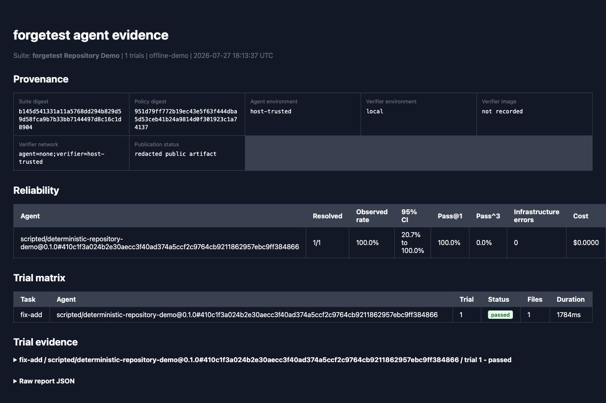

# forgetest

Execution-backed regression and evidence harness for Rust coding agents.

[](https://github.com/MysterionRise/forgetest/actions/workflows/ci.yml)
[](docs/src/evidence.md)
[](https://github.com/MysterionRise/forgetest/releases)
[](#license)

`forgetest` gives a coding agent a fresh repository task, records a typed event
trace under output-byte and normalized-event limits, captures the resulting
filesystem patch independently of Git, and grades that patch in a clean
verification workspace. It preserves the original provider-based snippet
evaluator, but repository-level agent trials are the primary v1 direction.

The project is designed to answer a narrow engineering question:

> Did this exact agent, model, policy, and task corpus produce a verified change,
> and can another reviewer inspect the evidence?

## Status

Implemented:

- Strict, digest-addressed repository suites and a calibrated 12-task Rust corpus.
- Generic command, Codex CLI, Claude Code, and deterministic scripted adapters.
- Local development trials and opt-in ephemeral agent containers.
- Independent hidden-grader overlay in a fresh local or hardened Docker verifier.
- Typed JSONL traces, trusted filesystem patches, explicit budgets, retries, and
  Unix process-group cleanup plus forced Docker-container cleanup.
- Report schema v2 with every scheduled outcome, Wilson intervals, pass@1,
  pass^3, paired bootstrap comparisons, cost, timing, and policy identity.
- Private raw bundles, deterministic SHA-256 artifact inventories, and a
  redacted public bundle.
- Exact benchmark lock generation and preflight checks for agent images,
  executable hashes, CLI versions, models, effort, verifier image, and policy.
- Legacy snippet reports and commands, including old report deserialization.

Not claimed:

- The pre-registered six-trial real-agent pilot has not been executed.
- The planned 72-trial Codex versus Claude study has not been run or published.
- Deterministic scripted demos are not model benchmarks.
- v1 does not claim safe execution of hostile repositories.
- Content identities and checksums are provenance evidence, not proof that two
  stochastic model calls will return the same output.

## Verified Proof Path

[The evidence ledger](docs/src/evidence.md) links the publication-safe reports
and separates executable proof from roadmap claims. The Pages workflow
publishes that ledger after a successful default-branch deployment. CI
calibrates all 12 tasks, executes the snippet and repository demos with local
and Docker verification, and verifies the repository evidence manifests plus
the committed sample-report contract.



The screenshot is generated from the deterministic local repository demo. It
shows report structure and provenance, not paid-model performance.

## Install

Release archives contain a single `forgetest` binary plus licenses, the
changelog, and README. Download the archive for your platform from the
[GitHub releases page](https://github.com/MysterionRise/forgetest/releases),
verify it against `SHA256SUMS`, and place the binary on your `PATH`.

To install from a source checkout:

```bash
cargo install --path crates/forgetest-cli --locked
forgetest --version
```

The crates.io publication channel is credential-gated and was not enabled for
`v0.1.0`; do not rely on `cargo install forgetest-cli` for this release.

Local verification requires `cargo` and `rustc`; snippet evaluation also runs
Clippy. This repository pins Rust 1.92.0 with the required components in
`rust-toolchain.toml`. Docker examples require Docker Engine, and real-agent
examples additionally require the selected agent CLI and its credential.

All examples below use the installed `forgetest` binary. From a source
checkout, `forgetest demo ...` is equivalent to:

```bash
cargo run --locked --bin forgetest -- demo ...
```

## First Run: No Keys

The repository demo exercises materialization, agent edits, hidden grading,
patch capture, redaction, HTML/SARIF rendering, and evidence manifests:

```bash
forgetest demo \
  --mode repository \
  --runner local \
  --output ./forgetest-results --format all
```

A successful run exits with status 0 and creates the key artifacts below:

```text
forgetest-results/
  raw/report.html
  raw/report.json
  raw/trials/<trial-id>/changes.patch
  raw/trials/<trial-id>/trace.jsonl
  public/report.html
  public/report.json
  public/artifact-manifest.json
```

Open `forgetest-results/public/report.html`. The agent edit is scripted and
deterministic; workspace reconstruction, compilation, tests, grading,
redaction, and report generation are executed normally. Use a fresh output
path when repeating a repository demo.

The legacy snippet loop is still available:

```bash
forgetest demo \
  --mode snippet \
  --runner local \
  --output ./snippet-results --format all
```

## Docker Proof

Build the pinned Rust verifier image, then run both no-key paths:

```bash
docker build \
  -f docker/forgetest-runner-rust.Dockerfile \
  -t forgetest-runner-rust:0.1.0 .

forgetest demo \
  --mode repository \
  --runner docker \
  --output ./repository-docker-results --format all

forgetest demo \
  --mode snippet \
  --runner docker \
  --output ./snippet-docker-results --format all
```

The Docker verifier uses a read-only root filesystem, non-root UID, no network,
no capabilities, `no-new-privileges`, tmpfs build output, resource limits, and
only the per-trial verification workspace mount. See [SECURITY.md](SECURITY.md)
for guarantees and non-guarantees.

The Docker build and the corpus paths below require a source checkout and must
be run from its root.

## Calibrated Corpus

`eval-suites/rust-agent-v1` contains 12 repository tasks:

- 8 authored fixtures.
- 4 fixture-focused adaptations of permissively licensed upstream fixes from
  Cargo, Tokio, bytes, and ripgrep, with source revision and audit metadata.
- Bug fixes, features, API migrations, async/concurrency, and
  security/robustness work.
- A fail-to-pass hidden check and pass-to-pass regression check for every task.
- A reference patch used only as a calibration oracle.

Prove that every null patch fails and every reference patch passes:

```bash
forgetest validate \
  --suite eval-suites/rust-agent-v1/suite.toml \
  --calibrate
```

Calibration runs trusted suite commands on the host. It is appropriate for the
audited bundled corpus, not arbitrary downloaded suites.

## Real Agent Trials

Local development mode runs installed agent CLIs under an explicit environment
allowlist and uses the selected verifier:

```bash
forgetest agents doctor \
  --agents codex/MODEL,claude/MODEL

forgetest run \
  --suite eval-suites/rust-agent-v1/suite.toml \
  --agents codex/MODEL,claude/MODEL \
  --trials 1 --profile development --runner docker \
  --output ./agent-results --format all
```

Replace each `MODEL` with an exact model identifier accepted by that installed
agent CLI. The harness rejects moving aliases in benchmark locks.

Published benchmark mode requires immutable agent and verifier images. First
create an exact lock:

```bash
forgetest agents lock \
  --suite eval-suites/rust-agent-v1/suite.toml \
  --agent codex/MODEL=registry.example/codex@sha256:DIGEST \
  --agent claude/MODEL=registry.example/claude@sha256:DIGEST \
  --effort codex=high \
  --effort claude=high \
  --verifier-image registry.example/forgetest-runner-rust@sha256:DIGEST \
  --trials 3 \
  --output benchmark.lock.toml
```

Then run the sealed policy:

```bash
forgetest run \
  --suite eval-suites/rust-agent-v1/suite.toml \
  --agents codex,claude --trials 3 --profile benchmark \
  --benchmark-lock benchmark.lock.toml \
  --output ./study-run --format all
```

The lock command performs a credential-free, network-disabled image preflight.
The benchmark run rejects requested-model, command-profile, CLI, executable,
image, suite, and policy drift. It cannot independently detect a provider-side
model substitution unless the vendor exposes that identity in its events.

Recheck a saved lock without exposing credentials:

```bash
forgetest agents doctor --benchmark-lock benchmark.lock.toml
```

The required agent-image runtime contract is documented in
[docker/agents/README.md](docker/agents/README.md).

## Trial Lifecycle


```mermaid
flowchart LR
    A["Strict suite and policy validation"] --> B["Fresh visible workspace"]
    B --> C["Bounded agent execution and live JSONL trace"]
    C --> D["Trusted filesystem snapshot and patch"]
    D --> E["Fresh verification workspace"]
    E --> F["Hidden grader overlay"]
    F --> G["Network-disabled verifier"]
    G --> H["Atomic trial record"]
    H --> I["Raw and redacted evidence bundles"]
```

Each trial ends as one of `passed`, `failed`, `agent_error`,
`environment_error`, `grader_error`, `timeout`, or `cancelled`. Infrastructure
errors are reported separately from task failures.

## Evidence

With `--format all`, raw bundles contain:

- `report.json`, self-contained `report.html`, and deterministic-only SARIF.
- Per-trial `trace.jsonl`, `changes.patch`, and grader stdout/stderr.
- `artifact-manifest.json` with SHA-256 and size for every other bundle file.

Repository runs write both bundles automatically. Public bundles remove known
secrets, credential-shaped values, configured host paths, raw vendor events,
free-form model messages, private reasoning fields, private artifact
references, and free-form text from retained event categories. Event type,
timestamp, and sequence remain available for public timelines. To re-redact a
saved raw report, select a new output path:

```bash
forgetest redact \
  --input ./study-run/raw/report.json \
  --output ./study-run/public-review \
  --format all
```

Use a fresh output path for repository runs, repository demos, and redaction;
these workflows reject non-empty evidence destinations. Snippet runs write
timestamped report files and may reuse a directory, although a fresh directory
is easier to audit.

Schema v2 comparisons gate only when suite, task, and execution-policy digests
match. `--allow-incomparable` permits an explicitly non-gating comparison.

## Legacy Snippet Evaluation

The original provider path remains supported for small function-level tests:

```bash
forgetest validate --eval-set eval-sets/rust-basics.toml

forgetest run \
  --config ./forgetest.toml \
  --eval-set eval-sets/rust-basics.toml \
  --models anthropic/MODEL \
  --pass-k 1,3 --temperature 0.7 \
  --output ./snippet-results --format all
```

Run `forgetest init` in a new directory to generate a starter config and eval
set. A project-local config is loaded only when passed with `--config`.

Snippet scoring is diagnostic, not the repository benchmark outcome:

| Component | Weight |
|---|---:|
| Compilation | 30% |
| Tests | 45% |
| Structure | 15% |
| Clippy | 10% |

Repository tasks use binary required-check outcomes as the primary score.

## Crates

| Crate | Responsibility |
|---|---|
| `forgetest-core` | Schemas, suite loading, lifecycle, statistics, comparison |
| `forgetest-agents` | Command/Codex/Claude/scripted adapters and benchmark locks |
| `forgetest-runner` | Local runner, Docker verifier, calibration |
| `forgetest-providers` | Legacy Anthropic, OpenAI, Ollama, and mock providers |
| `forgetest-report` | HTML, SARIF, redaction, evidence manifests |
| `forgetest-cli` | Trusted configuration and user workflows |

See [ARCHITECTURE.md](ARCHITECTURE.md) for boundaries and data flow.

## CI Proof Contract

The checked-in workflow is configured to prove:

```bash
cargo fmt --all -- --check
cargo clippy --workspace --all-targets --locked -- -D warnings
cargo test --workspace --all-targets --locked
RUSTDOCFLAGS="-D warnings" cargo doc --workspace --no-deps --locked
mdbook build docs
cargo audit
cargo deny check licenses sources
```

It also calibrates all 12 tasks, smoke-tests an installed binary, builds the
Docker verifier, runs gated Docker integration tests, executes local and Docker
no-key demos, verifies the committed sample-report contract, and uploads their
evidence. Tagged releases publish the verifier to GHCR by immutable digest and
attach SHA-256 checksums, CycloneDX SBOMs, and GitHub provenance attestations.
These become proven claims only for commits or tags with a green linked
workflow run.

## Harbor Bridge

`forgetest harbor export` and `forgetest harbor import` support only
forgetest-marked Rust/Docker tasks. The bridge preserves prompts, visible
workspaces, hidden graders, reference patches, and named verifier checks. It
rejects unmarked or unsupported Harbor tasks rather than claiming general
compatibility.

## Limitations

- Rust is the only fully supported v1 language.
- Local execution is for trusted development and clears the child environment,
  but it is not a security sandbox.
- Agent containers need network access for hosted model APIs. The independent
  verifier has network disabled.
- Docker reduces host exposure but does not defend against kernel, runtime, or
  compiler exploits.
- Unix host-agent processes are terminated as a process group. Windows host
  development mode can only guarantee termination of the direct child; use
  container benchmark mode for published evidence.
- Agent-reported token and cost fields are evidence from vendor output, not
  independently metered billing records.
- Exact requested model strings are locked, but server-side model routing cannot
  be independently verified when an agent vendor does not report it.
- `custom_check` in legacy snippet files fails as unsupported rather than
  executing an arbitrary shell command.
- The four upstream corpus entries are reduced adaptations, not complete
  repository snapshots.

## Study Status

The release pilot is pre-registered as
`3 tasks x 2 agents x 1 trial = 6 trials`, using exact model IDs
`gpt-5.6-sol` and `claude-sonnet-5`. Its protocol and empty results template
are in [studies/rust-agent-pilot](studies/rust-agent-pilot/README.md). No result
is asserted until all six outcomes and the reviewed redacted bundle exist.

The v1 study protocol is `12 tasks x 2 agents x 3 trials = 72 trials`. The
tooling computes success rates, Wilson 95% intervals, pass@1, pass^3,
task-paired bootstrap intervals, costs, and infrastructure failures. Exact
models and immutable images must be selected at release-candidate time. No
paid-agent result is asserted in this repository until that dated run and its
redacted evidence are published.

## Documentation

- [Architecture](ARCHITECTURE.md)
- [Security model](SECURITY.md)
- [CTO case study](docs/src/case-study.md)
- [Changelog](CHANGELOG.md)
- [Repository suite format](docs/src/repository-suites.md)
- [Benchmark operations](docs/src/advanced.md)

## License

Licensed under either [Apache-2.0](LICENSE-APACHE) or [MIT](LICENSE-MIT), at
your option. Adapted corpus tasks retain provenance and license records in each
`task.toml`.
